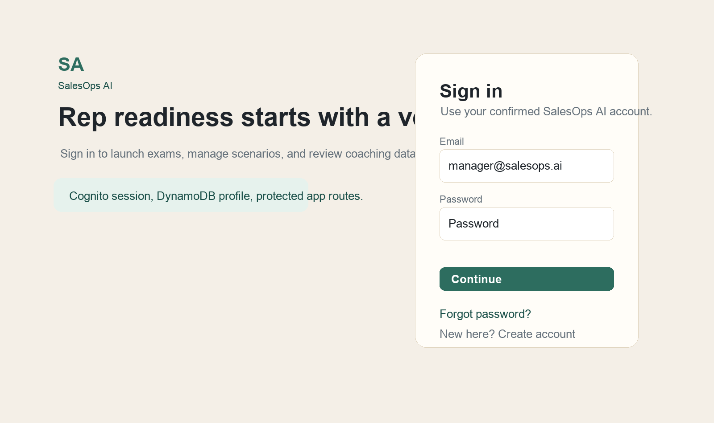
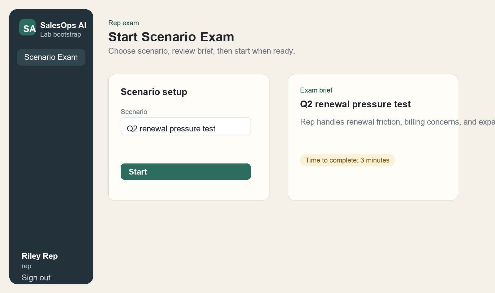
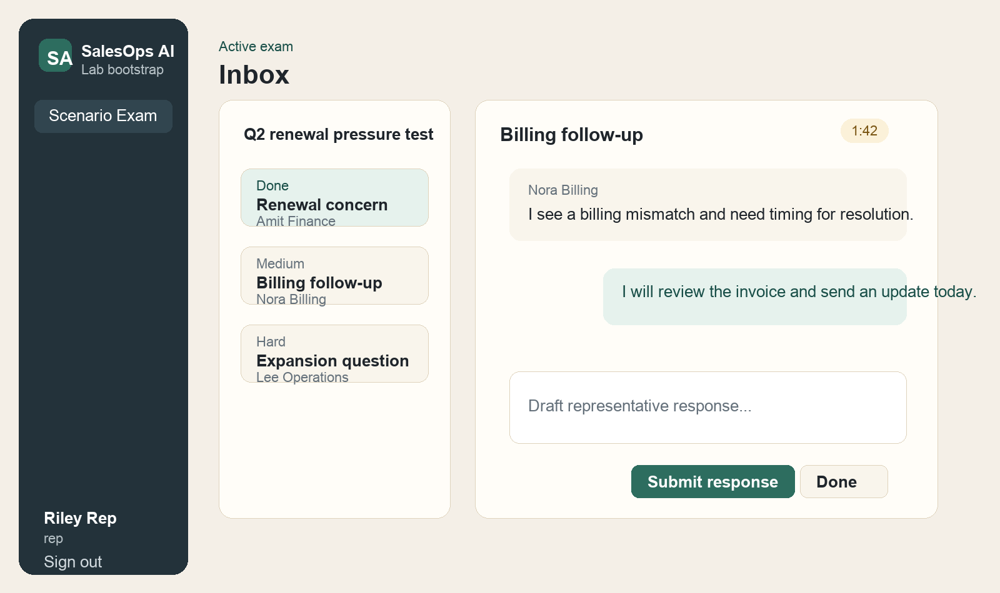
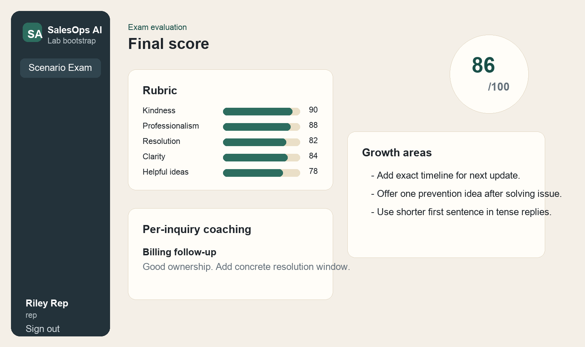
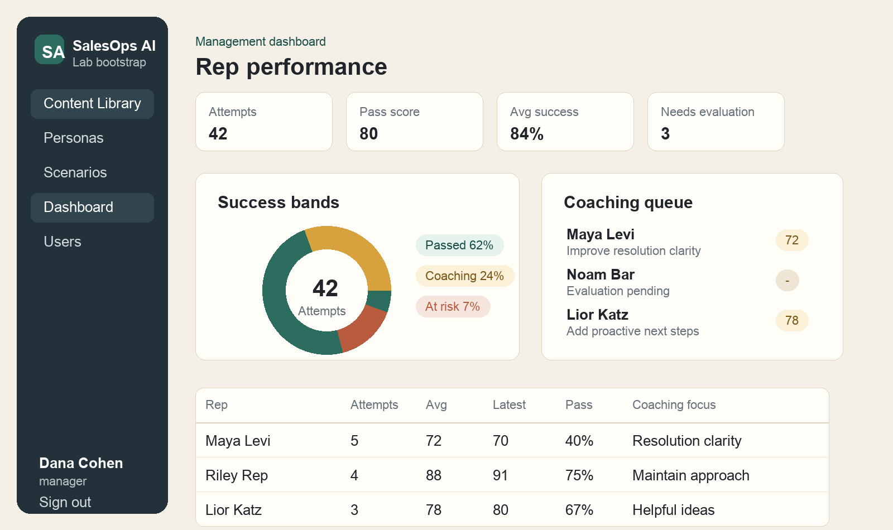
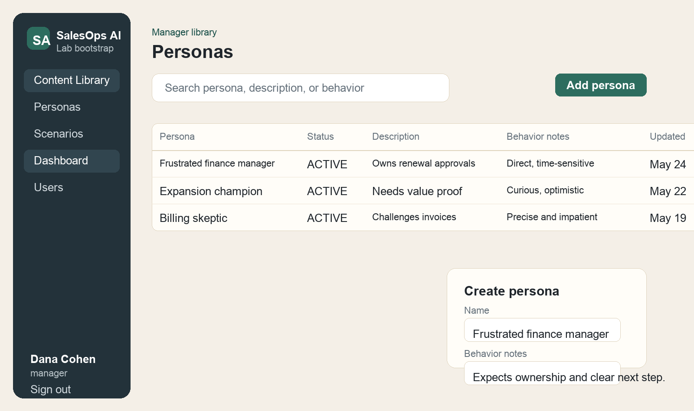
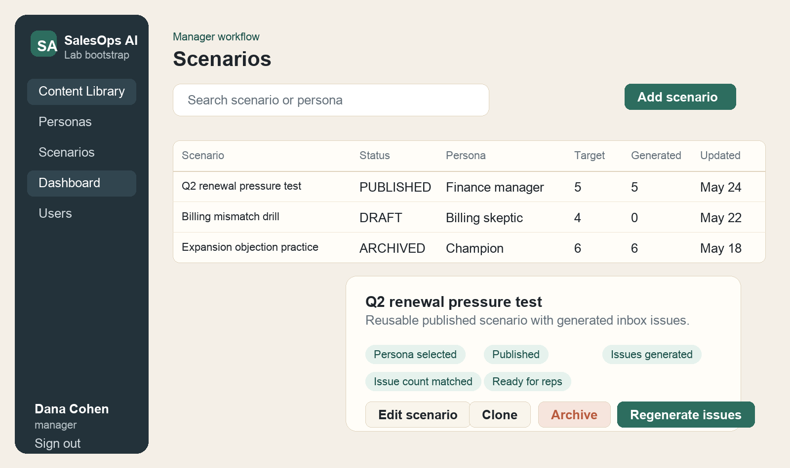
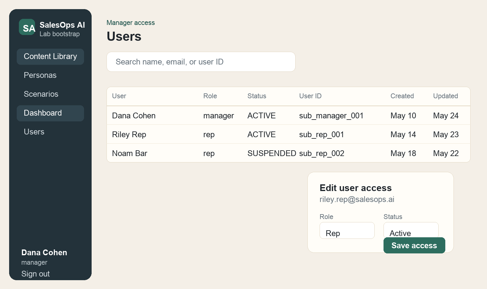

# Section 07 - User Guide

Project: SalesOps AI

Prepared: May 24, 2026

Language: English

Audience: Sales representatives and managers who use the SalesOps AI web application.

Source of truth: current frontend pages, API client, backend Lambda handlers, `README.md`, `docs/auth-setup.md`, `docs/aws-lab-setup.md`, and `docs/milestones.md`.

## What SalesOps AI Does

SalesOps AI is a training and examination platform for sales and service teams. Managers create customer personas and exam scenarios. The system generates realistic customer inbox issues. Reps take timed scenario exams, answer incoming issues, and receive AI scoring with coaching notes.

The application has two user roles:

- Rep: takes scenario exams and reviews coaching results.
- Manager: manages personas, scenarios, users, and performance dashboards.

All users sign in through the same login page. The system decides what each user can see based on the role stored in the user profile.

## Basic Navigation

After sign in, the left sidebar is the main navigation area.

- Reps see Scenario Exam.
- Managers see Content Library, Personas, Scenarios, Dashboard, and Users.
- The user name and role appear at the bottom of the sidebar.
- Sign out is at the bottom of the sidebar.

If you try to open a page that does not match your role, the app redirects you to your correct home page.

## Account Setup

### Create a New Account

1. Open the application.
2. Select Create account from the sign-in page.
3. Enter full name, email, password, and password confirmation.
4. Select Create account.
5. Check your email for the Cognito confirmation code.
6. Enter the code on the confirmation screen.
7. Select Confirm email.
8. Return to sign in.

New accounts start as reps. A manager can promote a confirmed user to manager from the Users page.

### Confirm Email

If the confirmation code is missing or expired:

1. Stay on the confirmation screen.
2. Select Resend code.
3. Check your email for the new code.
4. Enter the new code.
5. Select Confirm email.

Pending users cannot be promoted or suspended until email confirmation is complete.

### Sign In

1. Open `/login`.
2. Enter confirmed email and password.
3. Select Continue.
4. The system sends reps to Scenario Exam and managers to Dashboard.

If your account is suspended, sign in is blocked. Contact a manager or system administrator.

### Reset Password

1. On the sign-in page, select Forgot password?
2. Enter your email.
3. Select Send reset code.
4. Check your email for the reset code.
5. Enter the code.
6. Enter and confirm the new password.
7. Select Reset password.
8. Return to sign in and use the new password.

---

## Rep Guide

This chapter is for representatives who take exams.

### Start a Scenario Exam

1. Sign in as a rep.
2. Open Scenario Exam.
3. Choose a published scenario from the Scenario dropdown.
4. Read the exam brief on the right side.
5. Confirm the time limit.
6. Select Start.

Only published scenarios with generated issues appear in the list. If no scenarios appear, a manager still needs to publish a scenario and generate issues.

### Understand the Exam Timer

Each exam currently lasts 3 minutes.

- The timer appears in the active exam screen.
- New issues arrive during the session.
- When time ends, response entry is locked.
- After time ends, continue to AI evaluation.

### Work with the Exam Inbox

1. After the exam starts, the first issue appears immediately.
2. New issues arrive during the exam.
3. The inbox list shows each visible issue.
4. Select an issue to read the customer message.
5. The selected issue opens in the response area.

The inbox item shows:

- Difficulty or Done state.
- Subject.
- Customer name.

When a new issue arrives, a notification appears on screen.

### Submit a Response

1. Select the issue you want to answer.
2. Read the customer message.
3. Type your response in the response box.
4. Select Submit response.
5. The response appears in the chat thread.

You can submit more than one response to the same issue before marking it done, as long as the exam is still active.

Good responses should:

- Acknowledge the customer concern.
- Stay professional and calm.
- Give a practical next step.
- Be clear and concise.
- Offer helpful options when useful.

### Mark an Issue Done

1. Submit at least one response.
2. Select Done.
3. The issue moves to Done state.

After an issue is done, it cannot receive more responses. Use Done only when your answer is complete.

### Finish the Exam

When the timer reaches zero:

1. The exam shows Exam Ended.
2. Responses are locked.
3. Select Continue to Evaluation.
4. Wait while the system prepares the AI evaluation.
5. The app opens the results page.

The system will not evaluate an exam while it is still active.

### Review Results

The results page shows:

- Final score out of 100.
- Rubric scores.
- AI notes.
- Strengths.
- Growth areas.
- Practice ideas.
- Per-issue coaching.
- Suggested answer ideas.

Use Growth areas and Practice ideas to improve your next attempt.

### Rep Troubleshooting

- No scenarios available: ask a manager to publish a scenario and generate issues.
- Cannot sign in: confirm your email first, check password, or reset password.
- Account not active: your account may be suspended; contact a manager.
- Response box disabled: the exam ended or the issue is already done.
- Evaluation not ready: return to the exam and select Continue to Evaluation after time expires.

---

## Manager Guide

This chapter is for managers who create content, manage users, and review performance.

### Manager Home Dashboard

After manager sign in, the Dashboard opens first. It summarizes exam activity and coaching needs.

Dashboard includes:

- Total attempts.
- Pass score.
- Average success.
- Pass rate.
- Reps evaluated.
- Attempts completed.
- Needs evaluation count.
- Success band chart.
- Coaching queue.
- Rep roster table.

Managers can filter dashboard data by scenario, switch chart view, refresh data, and export CSV.

### Filter Dashboard by Scenario

1. Open Dashboard.
2. Use the Session dropdown.
3. Choose All sessions or a specific scenario.
4. Review updated metrics, chart, coaching queue, and rep roster.

### Export Dashboard CSV

1. Open Dashboard.
2. Apply the scenario filter you want.
3. Select Export CSV.
4. The browser downloads `salesops-dashboard-reps.csv`.

The CSV includes rep name, email, attempts, evaluated attempts, scores, pass rate, completion rate, needs evaluation count, last attempt, and coaching focus.

### Manage Personas

Personas describe customer behavior and guide issue generation.

1. Open Content Library.
2. Select Personas.
3. Use search to find persona text.
4. Use status filter when needed.
5. Select Add persona.
6. Enter persona name.
7. Add description.
8. Add behavior notes.
9. Select Save persona.

Persona examples:

- Frustrated finance manager.
- Billing skeptic.
- Expansion champion.

Behavior notes should explain tone, urgency, decision style, and what the customer expects.

### Edit a Persona

1. Open Personas.
2. Select a persona row or edit icon.
3. Update name, description, or behavior notes.
4. Select Save persona.

Changing a persona helps future issue generation. Existing generated issues do not automatically rewrite themselves; regenerate scenario issues when needed.

### Manage Scenarios

Scenarios define the exam situation. A scenario links to a persona and has a target number of inbox issues.

1. Open Content Library.
2. Select Scenarios.
3. Use search or filters to find existing scenarios.
4. Select Add scenario.
5. Enter title.
6. Enter description.
7. Choose persona.
8. Set issue count from 1 to 20.
9. Select Save draft or Publish.

### Publish a Scenario

1. Open Scenarios.
2. Create or edit a scenario.
3. Ensure a persona is selected.
4. Select Publish.

Publishing changes the scenario status to `PUBLISHED`. Reps still cannot start it until issues are generated.

### Check Scenario Readiness

Open scenario details and review the readiness checklist:

- Persona selected.
- Published.
- Issues generated.
- Issue count matched.
- Ready for reps.

A scenario is ready when it is published, has a persona, has generated issues, and generated issue count equals the target issue count.

### Generate Issues

1. Open a published scenario.
2. Select Generate issues.
3. Wait for issue generation.
4. Review generated issues.
5. If needed, edit each issue.

The system uses OpenAI when configured. If OpenAI is unavailable, the system creates demo issues so the training flow can continue. A warning appears when demo issues were used.

### Edit Generated Issues

1. Open scenario details.
2. Scroll to Generated issues.
3. Review customer name, subject, message, and difficulty.
4. Edit any field that needs correction.
5. Select Save issue for that issue.

Difficulty must be:

- Easy.
- Medium.
- Hard.

### Clone a Scenario

1. Open scenario details.
2. Select Clone.
3. The system creates a draft copy.
4. Edit the copy before publishing.

Cloning is useful when a scenario worked well and needs a variation.

### Archive a Scenario

1. Open scenario details.
2. Select Archive.
3. Confirm the action.

Archived scenarios are removed from rep exam availability. They remain in manager history.

### Manage Users

Managers can view users and change application-level role or active status.

1. Open Users.
2. Search by name, email, or user ID.
3. Filter by role or status.
4. Select a user row or edit icon.
5. Choose role: Rep or Manager.
6. Choose status: Active or Suspended.
7. Select Save access.

Important user access rules:

- Pending users must confirm email before access can change.
- A manager cannot demote or suspend their own manager account.
- Suspended users cannot sign in or use protected routes.
- Credentials remain in Cognito; the Users page controls app role and status.

### Manager Troubleshooting

- Cannot see manager pages: your profile role is not manager or account is not active.
- Scenario cannot publish: select at least one persona.
- Generate issues button disabled: scenario is not published.
- Generated issue save fails: customer name, subject, message, and difficulty are required.
- Reps cannot see scenario: verify status is published, issues exist, and generated count matches target.
- Dashboard has no data: reps have not completed exam attempts yet.
- Needs evaluation count is high: reps finished exams but evaluation was not created yet.

---

## Common Error Messages and Meaning

### Email, password, and full name are required

Signup form is missing required data. Fill all signup fields.

### Confirm your email before signing in

The account exists but email confirmation is not complete. Use the confirmation code sent by email.

### Account is not active

The user profile exists but status is not `ACTIVE`. Contact a manager or administrator.

### Manager access required

You are signed in as a rep or inactive user and tried to use a manager-only feature.

### Rep access required

You are signed in as a manager and tried to start or use a rep exam route.

### Scenario is not published

The scenario is still draft or archived. Publish it before reps can use it.

### Scenario has no generated issues

Generate issues before reps start an exam.

### Exam session has ended

The timer is over. Continue to evaluation instead of submitting more responses.

### Submit at least one response before marking this issue done

The Done button requires at least one submitted response.

## Glossary

- Persona: reusable customer behavior profile.
- Scenario: exam setup that combines title, description, persona, and issue count.
- Issue: customer inbox message inside a scenario or exam.
- Draft scenario: scenario being edited by manager.
- Published scenario: scenario approved for use after issue generation.
- Archived scenario: scenario hidden from reps.
- Exam session: one rep attempt for one scenario.
- Evaluation: AI scoring and coaching result after an exam.
- Pass score: manager dashboard threshold, currently 80.

## Recommended Training Flow

1. Manager creates personas.
2. Manager creates scenario draft.
3. Manager publishes scenario.
4. Manager generates and reviews issues.
5. Rep starts scenario exam.
6. Rep answers issues during the timer.
7. Rep receives evaluation.
8. Manager reviews dashboard and coaching queue.

This flow is the standard path for using SalesOps AI from content preparation to coaching review.
