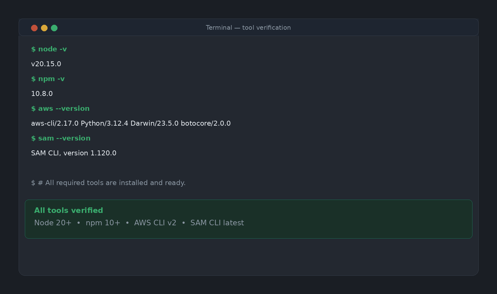
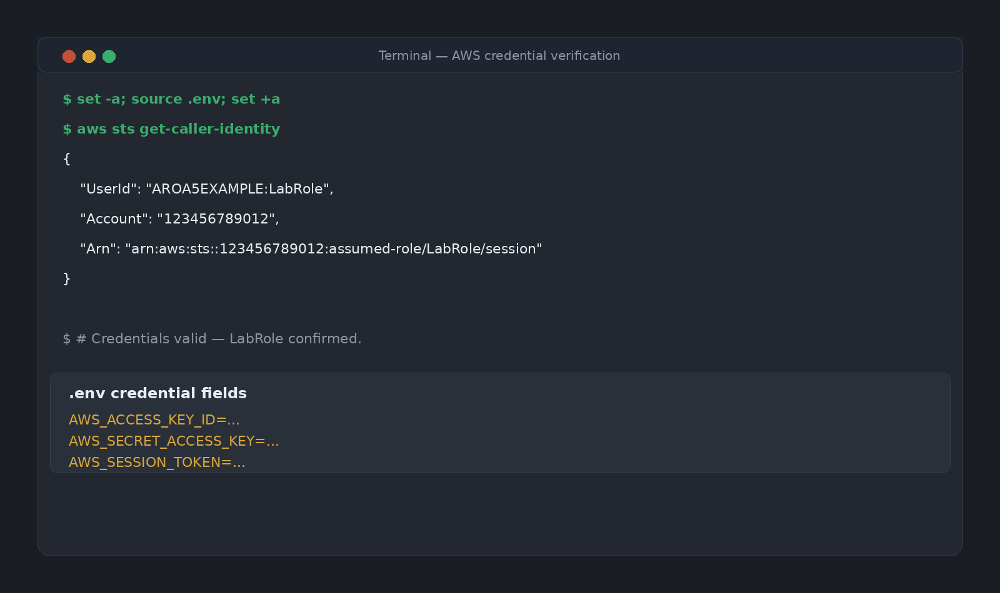
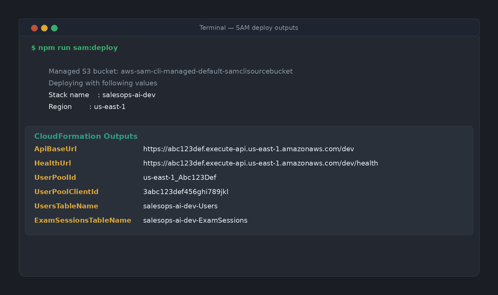
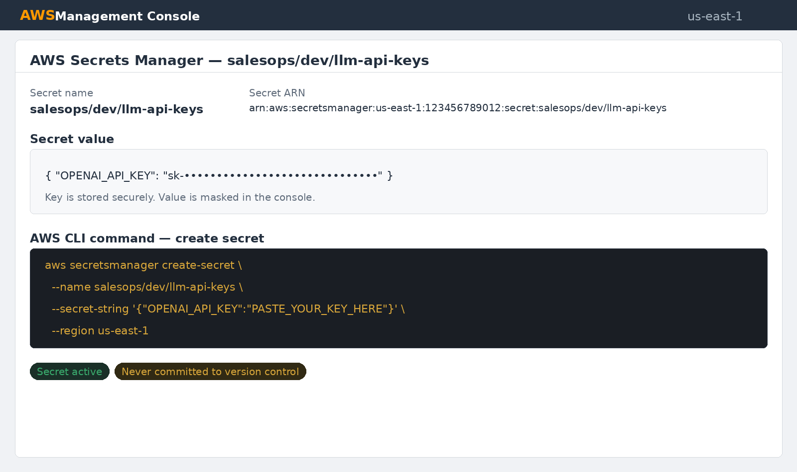
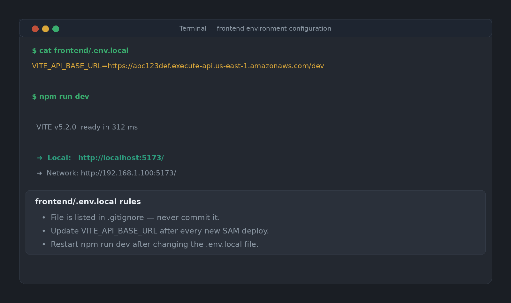
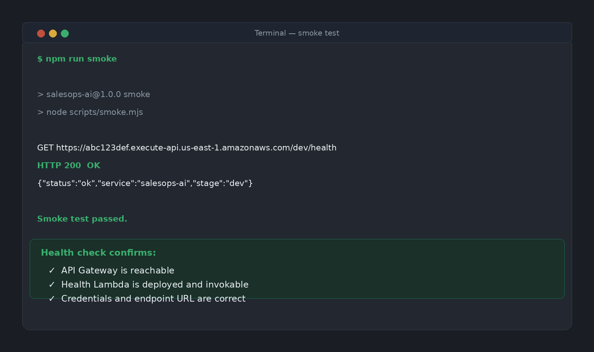
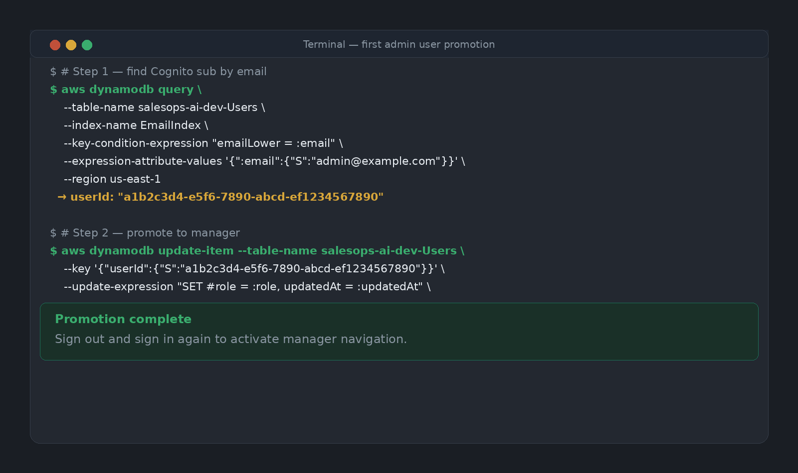
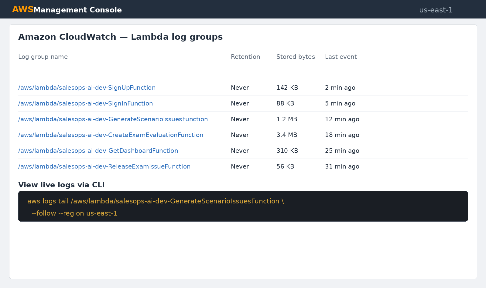

# Section 08 - System Administrator Guide

Project: SalesOps AI

Prepared: May 27, 2026

Language: English

Audience: System administrators responsible for deploying, configuring, and maintaining the SalesOps AI infrastructure on AWS.

Source of truth: `backend/template.yaml`, `backend/samconfig.toml`, `docs/aws-lab-setup.md`, `docs/auth-setup.md`, `README.md`, and all Lambda handler source files.

## What This Guide Covers

This guide explains how to deploy and operate SalesOps AI on AWS. It covers tool installation, credential management, backend deployment, first admin user promotion, frontend configuration, routine maintenance, and operational troubleshooting.

End-user instructions for representatives and business managers are in Section 07.

## System Architecture Summary

SalesOps AI is a fully serverless application. All infrastructure is defined in `backend/template.yaml` and deployed with AWS SAM and CloudFormation.

Components created during deployment:

- Amazon API Gateway REST API, stage `dev`.
- AWS Lambda functions for auth, content, exam, dashboard, and release logic.
- Amazon Cognito User Pool and web app client.
- Four Amazon DynamoDB tables: `Users`, `Personas`, `Scenarios`, `ExamSessions`.
- Amazon SQS queue for delayed exam issue release.
- AWS Secrets Manager secret for the OpenAI API key.

The frontend is a Vite and React application. It connects to the deployed API Gateway endpoint through an environment variable.

---

## Prerequisites

### Required Tools

Install all tools before attempting deployment.

| Tool | Minimum version | Purpose |
|------|----------------|---------|
| Node.js | 20.x | Frontend build and npm scripts |
| npm | 10.x | Package management |
| AWS CLI | v2 | AWS access and credential management |
| AWS SAM CLI | latest | SAM build and deploy |

Verify tool versions before each deployment session:

```
node -v
npm -v
aws --version
sam --version
```

### Install AWS CLI

Download from the official AWS docs. On macOS with Homebrew:

```
brew install awscli
```

### Install AWS SAM CLI

```
brew install aws-sam-cli
```

Verify:

```
sam --version
```



---

## AWS Credentials

### AWS Academy Lab Credentials

The project targets an AWS Academy student lab account. Lab credentials are temporary and expire each session.

1. Open the student lab portal.
2. Start the lab session.
3. Copy the credentials for the AWS CLI option.
4. Paste credentials into the root `.env` file in the repository:

```
AWS_ACCESS_KEY_ID=PASTE_HERE
AWS_SECRET_ACCESS_KEY=PASTE_HERE
AWS_SESSION_TOKEN=PASTE_HERE
```

5. Load credentials into the current shell:

```
set -a; source .env; set +a
```

6. Verify credentials loaded correctly:

```
aws sts get-caller-identity
```

A successful response returns an account ID, user ID, and ARN. The ARN confirms the `LabRole` student identity.

Important rules:

- Never commit the root `.env` file. It is in `.gitignore`.
- Repeat the credential steps every new lab session because temporary credentials expire.
- Do not run `aws configure` with lab credentials. Use the `.env` load method instead.



---

## Deploy the Backend

### First-Time Deployment

From the repository root:

```
npm install
npm run sam:build
npm run sam:deploy:guided
```

The guided deploy prompts for configuration. Use these values:

| Prompt | Value |
|--------|-------|
| Stack name | `salesops-ai-dev` |
| Region | `us-east-1` |
| AWS profile | none |
| Confirm before deploy | Y |
| Allow IAM role creation | N |
| Disable rollback | N |
| Save config to file | Y |

The template uses the AWS Academy `LabRole` for all Lambda functions. The deploy does not create new IAM roles because the lab environment blocks role creation.

After confirmation, SAM uploads the Lambda package and creates or updates the CloudFormation stack.

### Deployment Outputs

After a successful deploy, SAM prints the stack outputs. Copy the `ApiBaseUrl` value. You will need it to configure the frontend.

Key outputs:

| Output key | Description |
|------------|-------------|
| `ApiBaseUrl` | Base URL for `VITE_API_BASE_URL` |
| `HealthUrl` | Health endpoint for smoke testing |
| `UserPoolId` | Cognito User Pool ID |
| `UserPoolClientId` | Cognito app client ID |
| `UsersTableName` | DynamoDB users table name |
| `PersonasTableName` | DynamoDB personas table name |
| `ScenariosTableName` | DynamoDB scenarios table name |
| `ExamSessionsTableName` | DynamoDB exam sessions table name |
| `ExamIssueReleaseQueueUrl` | SQS queue URL |



### Re-Deployment

For subsequent deploys after the configuration file exists:

```
npm run sam:build
npm run sam:deploy
```

The non-guided deploy uses `backend/samconfig.toml` for all parameters. Review `samconfig.toml` before each deploy to confirm the stack name and region are correct.

---

## Configure the OpenAI Secret

The issue generation and exam evaluation Lambda functions require an OpenAI API key stored in AWS Secrets Manager.

### Create the Secret

Run once after the first deployment:

```
aws secretsmanager create-secret \
  --name salesops/dev/llm-api-keys \
  --secret-string '{"OPENAI_API_KEY":"PASTE_YOUR_KEY_HERE"}' \
  --region us-east-1
```

Replace `PASTE_YOUR_KEY_HERE` with the actual OpenAI API key. Do not commit the key to version control.

### Update an Existing Secret

If the secret already exists from a previous session:

```
aws secretsmanager put-secret-value \
  --secret-id salesops/dev/llm-api-keys \
  --secret-string '{"OPENAI_API_KEY":"PASTE_YOUR_KEY_HERE"}' \
  --region us-east-1
```

### Verify the Secret Exists

```
aws secretsmanager describe-secret \
  --secret-id salesops/dev/llm-api-keys \
  --region us-east-1
```

The command returns the secret ARN and name without revealing the key value.



Behavior when the secret is missing or invalid:

- Issue generation falls back to clearly marked demo issues.
- Exam evaluation returns an error and no coaching result is created.
- A warning message appears in the frontend when demo issues were used.

---

## Configure the Frontend

### Create the Frontend Environment File

Create `frontend/.env.local` in the repository. This file is in `.gitignore` and must not be committed.

```
VITE_API_BASE_URL=https://YOUR_API_ID.execute-api.us-east-1.amazonaws.com/dev
```

Replace `YOUR_API_ID` with the `ApiBaseUrl` value from the deployment outputs.

### Start the Development Server

```
npm run dev
```

The frontend starts on `http://localhost:5173` by default. Open the address in a browser to confirm the login screen loads.

### Build for Production

```
npm run build
```

The build output goes to `frontend/dist/`. Deploy this directory to a static hosting service such as Amazon S3 with Amazon CloudFront if a public deployment is required. Configure the S3 bucket and CloudFront distribution to serve `index.html` for all routes.



---

## Smoke Test

After deploy and frontend configuration, run the smoke test to confirm the API endpoint is reachable:

```
npm run smoke
```

The smoke script calls `GET /health` on the deployed API and verifies a successful response. A passing result confirms:

- API Gateway is running.
- The health Lambda function is deployed and invokable.
- Credentials are valid and the endpoint is reachable.

If the smoke test fails, check that credentials are loaded, the stack deployed successfully, and `VITE_API_BASE_URL` points to the correct endpoint.



---

## First Admin User Setup

After deployment, all newly registered users start as representatives with `PENDING_CONFIRMATION` status. There is no default admin account.

### Step 1: Create a User Account

Open the application in a browser, create a new account, and confirm the email.

### Step 2: Find the Cognito Sub

Look up the user record by email to get the Cognito `sub` (user ID):

```
aws dynamodb query \
  --table-name salesops-ai-dev-Users \
  --index-name EmailIndex \
  --key-condition-expression "emailLower = :email" \
  --expression-attribute-values '{":email":{"S":"admin@example.com"}}' \
  --region us-east-1
```

Copy the `userId` value from the result. This is the Cognito `sub`.

### Step 3: Promote to Manager

```
aws dynamodb update-item \
  --table-name salesops-ai-dev-Users \
  --key '{"userId":{"S":"PASTE_USER_ID_HERE"}}' \
  --update-expression "SET #role = :role, updatedAt = :updatedAt" \
  --expression-attribute-names '{"#role":"role"}' \
  --expression-attribute-values \
    '{":role":{"S":"manager"},":updatedAt":{"S":"2026-05-27T00:00:00.000Z"}}' \
  --region us-east-1
```

Replace `PASTE_USER_ID_HERE` with the Cognito `sub` from step 2.

### Step 4: Verify Promotion

Sign out of the application and sign in again. The sidebar should show the manager navigation items: Content Library, Personas, Scenarios, Dashboard, and Users.



After the first manager account exists, that manager can promote other users from the Users page inside the application without needing AWS CLI access.

---

## DynamoDB Administration

### View Table Contents

List items in the Users table:

```
aws dynamodb scan \
  --table-name salesops-ai-dev-Users \
  --region us-east-1
```

List items in the Personas table:

```
aws dynamodb scan \
  --table-name salesops-ai-dev-Personas \
  --region us-east-1
```

### Suspend a User by CLI

```
aws dynamodb update-item \
  --table-name salesops-ai-dev-Users \
  --key '{"userId":{"S":"COGNITO_SUB"}}' \
  --update-expression "SET #status = :status, updatedAt = :updatedAt" \
  --expression-attribute-names '{"#status":"status"}' \
  --expression-attribute-values \
    '{":status":{"S":"SUSPENDED"},":updatedAt":{"S":"2026-05-27T00:00:00.000Z"}}' \
  --region us-east-1
```

### Clear All Exam Sessions

Use only in development or testing scenarios. This deletes all exam data and cannot be undone.

```
aws dynamodb scan \
  --table-name salesops-ai-dev-ExamSessions \
  --attributes-to-get sessionId recordId \
  --region us-east-1
```

Delete items individually using the returned keys. There is no bulk delete command in the AWS CLI. Use the AWS Console table editor or a custom script for bulk operations.

---

## Cognito Administration

### View the User Pool in the Console

1. Open the AWS Management Console.
2. Navigate to Amazon Cognito.
3. Select the User Pool named `salesops-ai-dev-users`.

The console shows all registered users, their confirmation status, and last sign-in time.

### Delete a User from Cognito

Deleting a user from Cognito does not delete the DynamoDB profile. Delete both records if a full removal is needed.

From the Cognito console, select the user and choose Delete. To use the CLI:

```
aws cognito-idp admin-delete-user \
  --user-pool-id YOUR_USER_POOL_ID \
  --username user@example.com \
  --region us-east-1
```

Get the `UserPoolId` from the CloudFormation stack outputs.

### Reset a User Password by Admin

```
aws cognito-idp admin-reset-user-password \
  --user-pool-id YOUR_USER_POOL_ID \
  --username user@example.com \
  --region us-east-1
```

The user receives an email with a temporary password.

---

## Routine Maintenance

### Refresh Lab Credentials

Lab credentials expire. Before each new lab session:

1. Open the lab portal and start the session.
2. Copy the new credentials.
3. Paste into the root `.env` file.
4. Run `set -a; source .env; set +a`.
5. Verify with `aws sts get-caller-identity`.

### Rebuild and Redeploy After Code Changes

After modifying any Lambda handler:

```
npm run sam:build
npm run sam:deploy
npm run smoke
```

Confirm the smoke test passes after each deployment.

### Check Stack Status

```
aws cloudformation describe-stacks \
  --stack-name salesops-ai-dev \
  --region us-east-1 \
  --query "Stacks[0].StackStatus"
```

Expected values:

| Status | Meaning |
|--------|---------|
| `CREATE_COMPLETE` | First deployment succeeded |
| `UPDATE_COMPLETE` | Update deployment succeeded |
| `ROLLBACK_COMPLETE` | Deployment failed and rolled back |
| `UPDATE_ROLLBACK_COMPLETE` | Update failed and rolled back |

### View Stack Events After a Failed Deployment

```
aws cloudformation describe-stack-events \
  --stack-name salesops-ai-dev \
  --region us-east-1 \
  --query "StackEvents[?ResourceStatus=='CREATE_FAILED' || ResourceStatus=='UPDATE_FAILED']"
```

Review the `ResourceStatusReason` field for the root cause.

### Delete the Stack

To remove all infrastructure:

```
aws cloudformation delete-stack \
  --stack-name salesops-ai-dev \
  --region us-east-1
```

This deletes all Lambda functions, API Gateway, Cognito resources, DynamoDB tables, and the SQS queue. DynamoDB data is permanently lost. Confirm with the team before running this command.

---

## CloudWatch Logs

Lambda function logs are written to CloudWatch Logs automatically. Each function has its own log group named `/aws/lambda/<FunctionName>`.

### View Recent Logs for the Auth Functions

```
aws logs tail /aws/lambda/salesops-ai-dev-SignUpFunction \
  --follow \
  --region us-east-1
```

Replace the function name with any deployed Lambda name from the CloudFormation stack.

### List All Log Groups

```
aws logs describe-log-groups \
  --log-group-name-prefix /aws/lambda/salesops-ai \
  --region us-east-1
```

### Find Errors in Logs

```
aws logs filter-log-events \
  --log-group-name /aws/lambda/salesops-ai-dev-GenerateScenarioIssuesFunction \
  --filter-pattern ERROR \
  --region us-east-1
```

Use this to diagnose issue generation or evaluation failures without opening the AWS console.



---

## Troubleshooting

### Smoke Test Fails with Connection Error

- Confirm lab credentials are loaded: `aws sts get-caller-identity`.
- Confirm the `VITE_API_BASE_URL` in `frontend/.env.local` matches the `ApiBaseUrl` stack output.
- Check the CloudFormation stack status. If it shows `ROLLBACK_COMPLETE`, the deployment did not succeed.

### SAM Build Fails

- Confirm `node -v` returns 20 or newer.
- Run `npm install` from the repo root.
- Check for syntax errors in modified Lambda handler files.
- Delete the `.aws-sam/` build cache directory and retry.

### SAM Deploy Fails with Credential Error

- Lab credentials may have expired. Refresh the `.env` file and reload.
- Confirm the region is `us-east-1` in `samconfig.toml`.

### CloudFormation Stack Stuck in ROLLBACK

- Run `aws cloudformation describe-stack-events` to read the failure reason.
- Fix the root cause in `template.yaml` or Lambda handler code.
- If the stack is in `ROLLBACK_COMPLETE` state, delete and redeploy from scratch.

### Users Cannot Sign In After Redeploy

- Check the Cognito User Pool ID in the new stack outputs.
- If the User Pool was deleted and recreated, all user accounts are gone. Users must re-register.
- Cognito User Pools are not replaced unless the SAM template resource name changes.

### Issue Generation Returns Demo Issues

- Confirm the Secrets Manager secret exists: `aws secretsmanager describe-secret --secret-id salesops/dev/llm-api-keys`.
- Confirm the secret value contains a valid `OPENAI_API_KEY`.
- Check CloudWatch logs for the `GenerateScenarioIssuesFunction` log group for error details.

### Lambda Timeout on Evaluation

- Exam evaluation uses a 30-second timeout and 256 MB memory.
- If timeouts occur frequently, check CloudWatch for the failure pattern.
- In the lab environment, OpenAI response time can vary. Demo mode is not available for evaluation.

### SQS Issues Not Releasing on Time

- The `ReleaseExamIssueFunction` consumes SQS messages with a delay.
- The pulse endpoint also reveals due issues by comparing `releaseAt` with the current time.
- If no issues appear during an exam, confirm the exam session started and the pulse endpoint is responding.

---

## Security Notes

- Do not commit `.env`, `.env.local`, or any file containing AWS credentials or API keys.
- The `.gitignore` file already excludes these files.
- CORS in the current template uses a wildcard origin (`*`). Replace with the final frontend origin before any public deployment.
- All Lambda functions use the shared AWS Academy `LabRole`. For non-lab production deployment, replace with least-privilege IAM policies for each function.
- Cognito User Pool passwords require a minimum of 8 characters, one uppercase letter, one lowercase letter, and one number.
- Representatives can only access their own exam sessions. The backend enforces session ownership checks on every exam route.
- Managers cannot demote or suspend their own accounts. The backend blocks this action.

---

## Configuration Reference

### SAM Template Parameters

| Parameter | Default | Description |
|-----------|---------|-------------|
| `StageName` | `dev` | API Gateway stage and resource name suffix |
| `LlmSecretName` | `salesops/dev/llm-api-keys` | Secrets Manager secret name for OpenAI key |
| `OpenAiModel` | `gpt-5-mini` | OpenAI model for issue generation and evaluation |

### Lambda Timeouts and Memory

| Function | Timeout | Memory | Reason |
|----------|---------|--------|--------|
| All others | 10 s | 128 MB | Default |
| `GenerateScenarioIssuesFunction` | 25 s | 256 MB | OpenAI call |
| `CreateExamEvaluationFunction` | 30 s | 256 MB | OpenAI call |
| `GetDashboardFunction` | 15 s | 256 MB | DynamoDB scan |

### DynamoDB Tables

| Table | Partition key | Sort key | Notes |
|-------|--------------|----------|-------|
| `Users` | `userId` | none | `EmailIndex` GSI on `emailLower` |
| `Personas` | `personaId` | none | |
| `Scenarios` | `scenarioId` | none | Issues stored inside the item |
| `ExamSessions` | `sessionId` | `recordId` | Composite key for META and ISSUE records |

### Cognito Token Validity

| Token | Validity |
|-------|---------|
| Access token | 1 hour |
| ID token | 1 hour |
| Refresh token | 30 days |

After an ID token expires, the frontend uses the refresh token to obtain a new one automatically.

---

## Recommended Admin Checklist Per Session

1. Start the lab session and copy fresh credentials.
2. Load credentials: `set -a; source .env; set +a`.
3. Verify identity: `aws sts get-caller-identity`.
4. Confirm the CloudFormation stack is in `UPDATE_COMPLETE` or `CREATE_COMPLETE`.
5. Confirm the Secrets Manager secret exists for the OpenAI key.
6. Run the smoke test: `npm run smoke`.
7. Start the frontend: `npm run dev`.
8. Sign in as a manager to confirm the full application is working.
